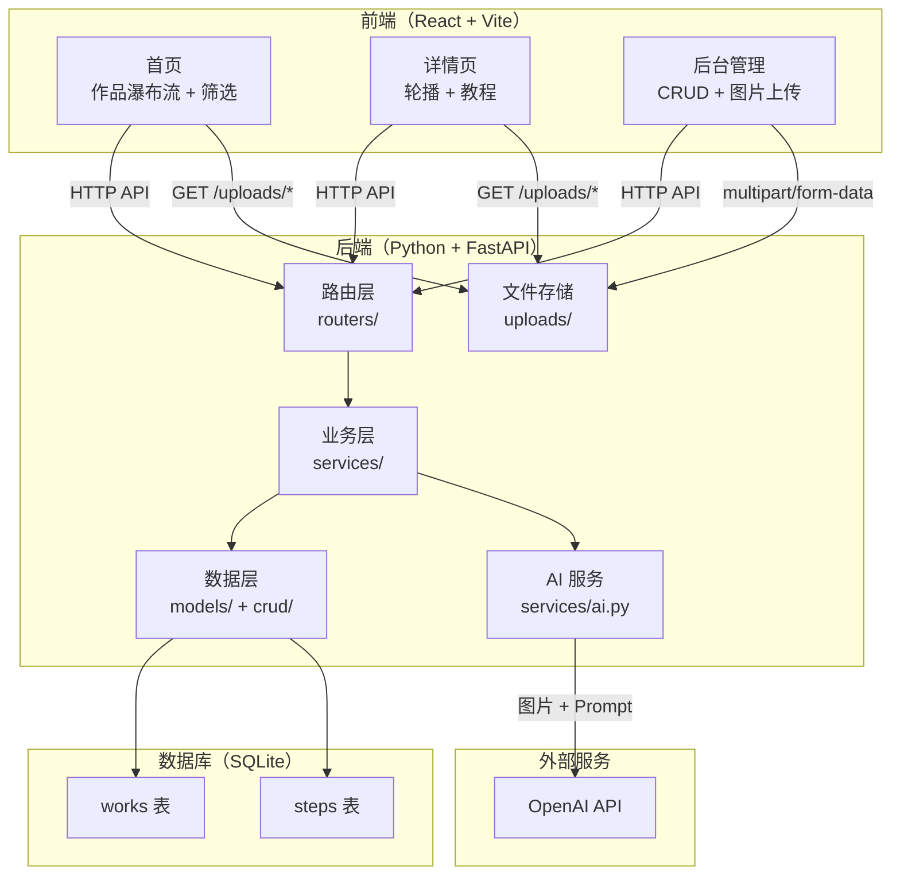

# CrochetHub — 技术方案文档

## 1. 技术选型

| 层级 | 技术栈 | 选型理由 |
|------|--------|----------|
| 前端框架 | React 18 + React Router v6 | 组件化开发，生态成熟，与作者技术栈一致 |
| 样式方案 | TailwindCSS | 原子化 CSS，快速出样式，无需写自定义样式文件 |
| 构建工具 | Vite | 开发体验好，HMR 极快，开箱即用 |
| 后端框架 | Python + FastAPI | 语法简洁、自带交互式 API 文档（Swagger UI）、异步支持好、与 AI 生态天然契合 |
| ORM | SQLAlchemy | Python 生态最主流的 ORM，支持 SQLite，模型定义清晰 |
| 数据库 | SQLite | 零配置、无需部署数据库服务、单文件便于演示 |
| 文件上传 | FastAPI UploadFile | 框架内置的文件上传支持，无需额外依赖 |
| AI 集成 | OpenAI API（GPT-4o） | 支持图片输入，可根据作品图片生成描述与材料推荐 |
| 部署 | Vercel（前端）+ Railway（后端） | 免费额度足够 MVP，支持自动部署 |

## 2. 系统架构



请求链路说明：前端通过 HTTP 请求访问后端 RESTful API。FastAPI 路由层接收请求并校验参数（借助 Pydantic 自动完成），业务层处理逻辑，数据层通过 SQLAlchemy 操作 SQLite 数据库，或调用 AI 服务层与 OpenAI API 交互。图片文件通过 FastAPI 的 UploadFile 存储到本地 uploads 目录，前端通过 StaticFiles 中间件访问。

## 3. 目录结构

```
crochet-hub/
├── docs/                          # 项目文档
│   ├── 01-PRD.md                  # 需求文档
│   ├── 02-technical-design.md     # 技术方案（本文档）
│   ├── 03-database-design.md      # 数据库设计
│   ├── 04-api-design.md           # API 设计
│   └── 05-flowcharts.md           # 流程图
│
├── server/                        # 后端（Python + FastAPI）
│   ├── app/
│   │   ├── main.py                # FastAPI 应用入口，中间件 & 路由注册
│   │   ├── config.py              # 配置管理（环境变量读取）
│   │   ├── database.py            # SQLAlchemy 引擎 & Session 管理
│   │   ├── routers/
│   │   │   ├── works.py           # 作品相关路由
│   │   │   ├── steps.py           # 教程步骤路由
│   │   │   └── ai.py              # AI 生成路由
│   │   ├── models/
│   │   │   ├── work.py            # 作品 ORM 模型
│   │   │   └── step.py            # 步骤 ORM 模型
│   │   ├── schemas/
│   │   │   ├── work.py            # 作品 Pydantic 模型（请求/响应校验）
│   │   │   └── step.py            # 步骤 Pydantic 模型
│   │   ├── crud/
│   │   │   ├── work.py            # 作品 CRUD 操作
│   │   │   └── step.py            # 步骤 CRUD 操作
│   │   └── services/
│   │       └── ai.py              # OpenAI API 封装
│   ├── uploads/                   # 图片存储目录
│   ├── requirements.txt           # Python 依赖
│   └── .env                       # 环境变量（OPENAI_API_KEY 等）
│
├── client/                        # 前端（React + Vite）
│   ├── src/
│   │   ├── main.jsx               # 应用入口
│   │   ├── App.jsx                # 根组件 + 路由配置
│   │   ├── pages/
│   │   │   ├── Home.jsx           # 首页（瀑布流 + 筛选）
│   │   │   ├── WorkDetail.jsx     # 作品详情页
│   │   │   ├── AdminList.jsx      # 后台作品列表
│   │   │   └── AdminForm.jsx      # 后台新建/编辑表单
│   │   ├── components/
│   │   │   ├── WorkCard.jsx       # 作品卡片组件
│   │   │   ├── ImageCarousel.jsx  # 图片轮播组件
│   │   │   ├── StepList.jsx       # 教程步骤列表
│   │   │   ├── FilterBar.jsx      # 筛选栏组件
│   │   │   └── ImageUpload.jsx    # 图片上传组件
│   │   ├── services/
│   │   │   └── api.js             # 后端 API 请求封装
│   │   └── index.css              # TailwindCSS 入口
│   ├── index.html
│   ├── vite.config.js
│   ├── tailwind.config.js
│   └── package.json
│
├── .gitignore
└── README.md
```

## 4. 前后端通信约定

前后端通过 RESTful API 通信，开发阶段前端通过 Vite 的 proxy 配置将 `/api/*` 请求代理到后端 `http://localhost:8000`，避免跨域问题。

接口基础路径统一为 `/api/v1`，响应格式统一为：

```json
{
  "success": true,
  "data": {},
  "message": "ok"
}
```

错误响应格式：

```json
{
  "success": false,
  "data": null,
  "message": "错误描述"
}
```

FastAPI 自带交互式 API 文档，开发阶段可通过 `http://localhost:8000/docs`（Swagger UI）或 `http://localhost:8000/redoc`（ReDoc）查看和测试接口。

## 5. 部署方案

开发阶段前端运行在 `localhost:5173`（Vite 默认），后端运行在 `localhost:8000`（Uvicorn 默认）。

生产部署时，前端构建为静态文件部署到 Vercel，后端部署到 Railway。前端通过环境变量 `VITE_API_BASE_URL` 指向 Railway 上的后端地址。后端通过 FastAPI 的 CORSMiddleware 允许 Vercel 域名访问。

SQLite 数据库文件随后端一起部署。Railway 支持持久化存储，数据不会因重启丢失。
