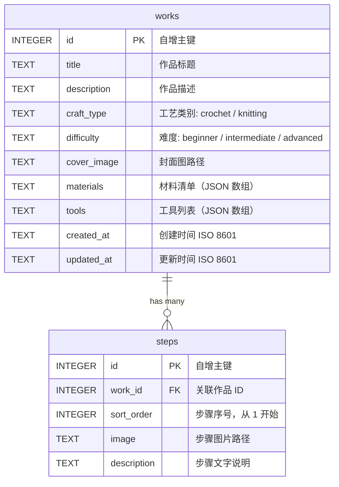

# CrochetHub — 数据库设计文档

## 1. ER 图



## 2. 表结构定义

### 2.1 works 表 — 作品

| 字段 | 类型 | 约束 | 说明 |
|------|------|------|------|
| id | INTEGER | PRIMARY KEY AUTOINCREMENT | 自增主键 |
| title | TEXT | NOT NULL | 作品标题 |
| description | TEXT | DEFAULT '' | 作品描述，支持 AI 生成后手动编辑 |
| craft_type | TEXT | NOT NULL, CHECK(craft_type IN ('crochet', 'knitting')) | 工艺类别：crochet=钩针, knitting=棒针 |
| difficulty | TEXT | NOT NULL, CHECK(difficulty IN ('beginner', 'intermediate', 'advanced')) | 难度等级 |
| cover_image | TEXT | DEFAULT NULL | 封面图片相对路径，如 `uploads/xxx.jpg` |
| materials | TEXT | DEFAULT '[]' | 材料清单，JSON 数组格式，如 `["4mm 钩针", "棉线 200g"]` |
| tools | TEXT | DEFAULT '[]' | 工具列表，JSON 数组格式，如 `["4mm 钩针", "记号扣"]` |
| created_at | TEXT | DEFAULT (datetime('now')) | 创建时间 |
| updated_at | TEXT | DEFAULT (datetime('now')) | 更新时间 |

### 2.2 steps 表 — 教程步骤

| 字段 | 类型 | 约束 | 说明 |
|------|------|------|------|
| id | INTEGER | PRIMARY KEY AUTOINCREMENT | 自增主键 |
| work_id | INTEGER | NOT NULL, FOREIGN KEY → works(id) ON DELETE CASCADE | 关联作品 |
| sort_order | INTEGER | NOT NULL | 步骤序号，从 1 开始，用于排序展示 |
| image | TEXT | DEFAULT NULL | 步骤图片相对路径 |
| description | TEXT | NOT NULL | 步骤文字说明 |

## 3. 建表 SQL

```sql
CREATE TABLE IF NOT EXISTS works (
    id          INTEGER PRIMARY KEY AUTOINCREMENT,
    title       TEXT    NOT NULL,
    description TEXT    DEFAULT '',
    craft_type  TEXT    NOT NULL CHECK(craft_type IN ('crochet', 'knitting')),
    difficulty  TEXT    NOT NULL CHECK(difficulty IN ('beginner', 'intermediate', 'advanced')),
    cover_image TEXT    DEFAULT NULL,
    materials   TEXT    DEFAULT '[]',
    tools       TEXT    DEFAULT '[]',
    created_at  TEXT    DEFAULT (datetime('now')),
    updated_at  TEXT    DEFAULT (datetime('now'))
);

CREATE TABLE IF NOT EXISTS steps (
    id          INTEGER PRIMARY KEY AUTOINCREMENT,
    work_id     INTEGER NOT NULL,
    sort_order  INTEGER NOT NULL,
    image       TEXT    DEFAULT NULL,
    description TEXT    NOT NULL,
    FOREIGN KEY (work_id) REFERENCES works(id) ON DELETE CASCADE
);

CREATE INDEX IF NOT EXISTS idx_steps_work_id ON steps(work_id);
CREATE INDEX IF NOT EXISTS idx_works_craft_type ON works(craft_type);
CREATE INDEX IF NOT EXISTS idx_works_difficulty ON works(difficulty);
```

## 4. 设计说明

**materials 和 tools 使用 JSON 字符串存储**而非独立关联表，原因是 MVP 阶段这两个字段是简单的字符串列表，不需要跨表查询或去重，JSON 存储在 SQLite 中足够高效，且大大简化了 CRUD 逻辑。后续如需支持材料/工具的全局管理与复用，可拆为独立表。

**steps 通过 sort_order 排序**而非依赖 id 自增顺序，这样支持用户在后台对步骤进行拖拽排序，只需更新 sort_order 字段即可。

**ON DELETE CASCADE** 确保删除作品时自动清理关联的步骤数据，避免孤儿记录。

**craft_type 和 difficulty 使用 CHECK 约束**，在数据库层面保证数据有效性，前端传入非法值时直接报错。
