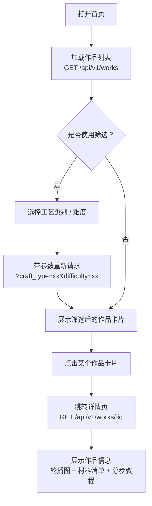
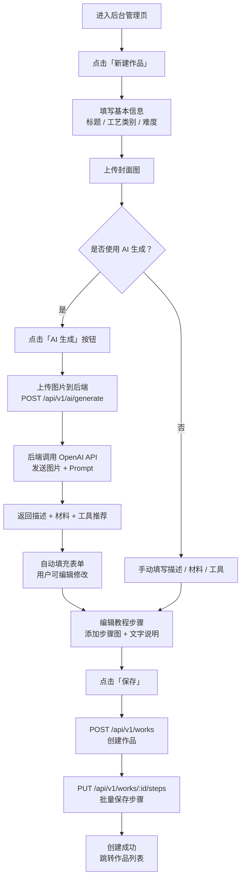
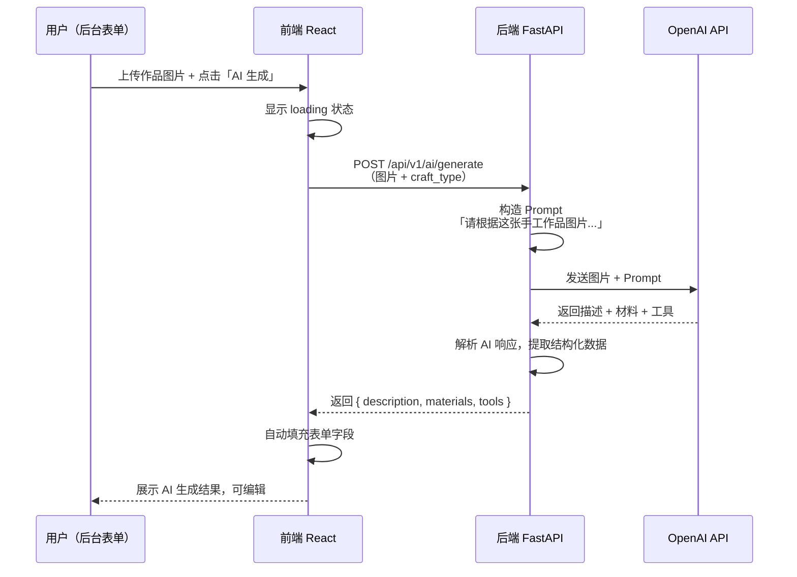
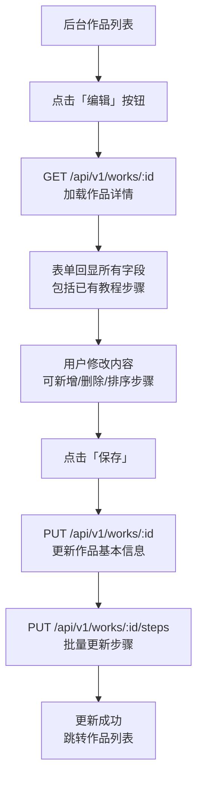
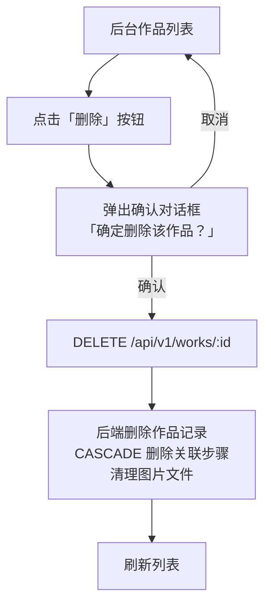

# CrochetHub — 关键流程图

## 1. 用户浏览流程

```mermaid
flowchart TD
    A["打开首页"] --> B["加载作品列表\nGET /api/v1/works"]
    B --> C{"是否使用筛选？"}
    C -->|"是"| D["选择工艺类别 / 难度"]
    D --> E["带参数重新请求\n?craft_type=xx&difficulty=xx"]
    E --> F["展示筛选后的作品卡片"]
    C -->|"否"| F
    F --> G["点击某个作品卡片"]
    G --> H["跳转详情页\nGET /api/v1/works/:id"]
    H --> I["展示作品信息\n轮播图 + 材料清单 + 分步教程"]
```

## 2. 作品发布流程（后台）

```mermaid
flowchart TD
    A["进入后台管理页"] --> B["点击「新建作品」"]
    B --> C["填写基本信息\n标题 / 工艺类别 / 难度"]
    C --> D["上传封面图"]
    D --> E{"是否使用 AI 生成？"}
    E -->|"是"| F["点击「AI 生成」按钮"]
    F --> G["上传图片到后端\nPOST /api/v1/ai/generate"]
    G --> H["后端调用 OpenAI API\n发送图片 + Prompt"]
    H --> I["返回描述 + 材料 + 工具推荐"]
    I --> J["自动填充表单\n用户可编辑修改"]
    E -->|"否"| K["手动填写描述 / 材料 / 工具"]
    J --> L["编辑教程步骤\n添加步骤图 + 文字说明"]
    K --> L
    L --> M["点击「保存」"]
    M --> N["POST /api/v1/works\n创建作品"]
    N --> O["PUT /api/v1/works/:id/steps\n批量保存步骤"]
    O --> P["创建成功\n跳转作品列表"]
```

## 3. AI 描述生成流程

```mermaid
sequenceDiagram
    participant U as 用户（后台表单）
    participant C as 前端 React
    participant S as 后端 FastAPI
    participant AI as OpenAI API

    U->>C: 上传作品图片 + 点击「AI 生成」
    C->>C: 显示 loading 状态
    C->>S: POST /api/v1/ai/generate<br/>（图片 + craft_type）
    S->>S: 构造 Prompt<br/>「请根据这张手工作品图片...」
    S->>AI: 发送图片 + Prompt
    AI-->>S: 返回描述 + 材料 + 工具
    S->>S: 解析 AI 响应，提取结构化数据
    S-->>C: 返回 { description, materials, tools }
    C->>C: 自动填充表单字段
    C-->>U: 展示 AI 生成结果，可编辑
```

## 4. 作品编辑流程

```mermaid
flowchart TD
    A["后台作品列表"] --> B["点击「编辑」按钮"]
    B --> C["GET /api/v1/works/:id\n加载作品详情"]
    C --> D["表单回显所有字段\n包括已有教程步骤"]
    D --> E["用户修改内容\n可新增/删除/排序步骤"]
    E --> F["点击「保存」"]
    F --> G["PUT /api/v1/works/:id\n更新作品基本信息"]
    G --> H["PUT /api/v1/works/:id/steps\n批量更新步骤"]
    H --> I["更新成功\n跳转作品列表"]
```

## 5. 作品删除流程

```mermaid
flowchart TD
    A["后台作品列表"] --> B["点击「删除」按钮"]
    B --> C["弹出确认对话框\n「确定删除该作品？」"]
    C -->|"取消"| A
    C -->|"确认"| D["DELETE /api/v1/works/:id"]
    D --> E["后端删除作品记录\nCASCADE 删除关联步骤\n清理图片文件"]
    E --> F["刷新列表"]
```
